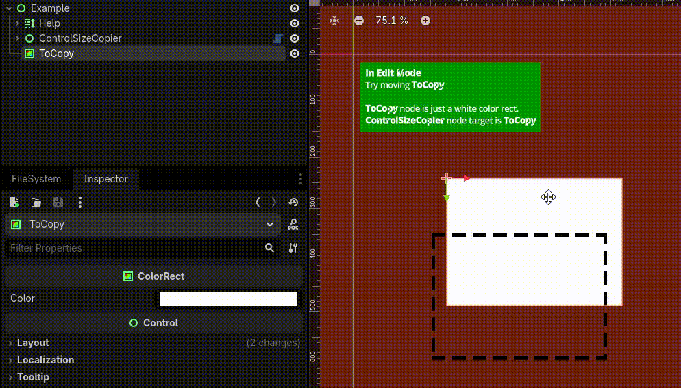
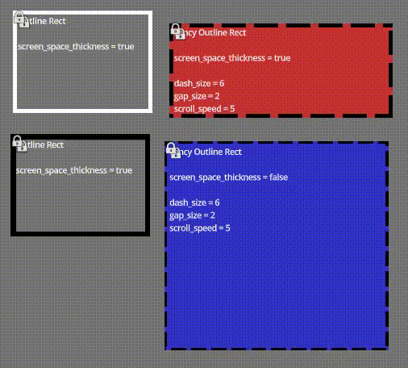
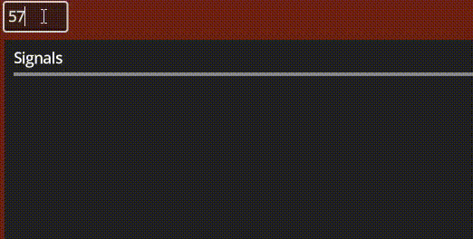
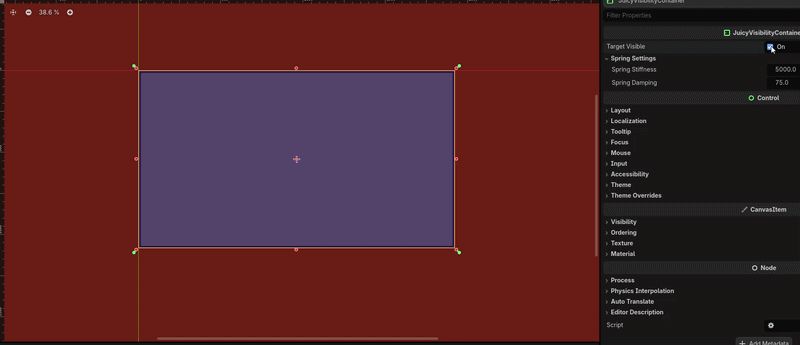

# Overview
A bunch of useful UI things I made.

# Install
Just download and drop in to your project.

Or as a git submodule
```
git submodule add https://github.com/JohnnyHowe/godot-jons-ui-extensions godot/addons/jons-ui-extensions
```

# Dependencies
## gdscript-script-test-runner
This is purely for testing. If you don't care, just delete the "tests" folder.

https://github.com/JohnnyHowe/gdscript-script-test-runner

# Parts

## `ControlSizeCopier`
Control Node that can copy the size and position of another.



## outline_rect: `OutlineRect` and `FancyOutlineRect`
Similar to builtin `ColorRect` but allow outlines.
Line thickness can be in world size or screen size -> really useful for debugging UI.

`OutlineRect`: Basic solid outline
`FancyOutlineRect`: Allows segmented lines (dotted, dashed) and "scrolling".



## `IntEdit`
An input field that only allows integers



## `JuicyVisibilityContainer`

A margin container that scales itself up and down with springs.



## `CustomContainerBase`
Abstract class that makes implementing new containers easy.
Handles listening for changes and getting all visible children.
